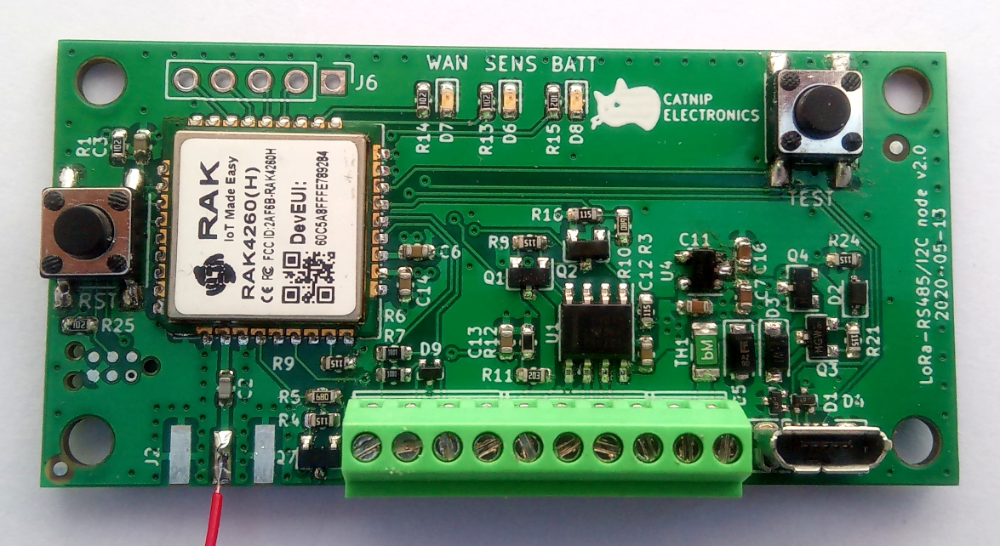
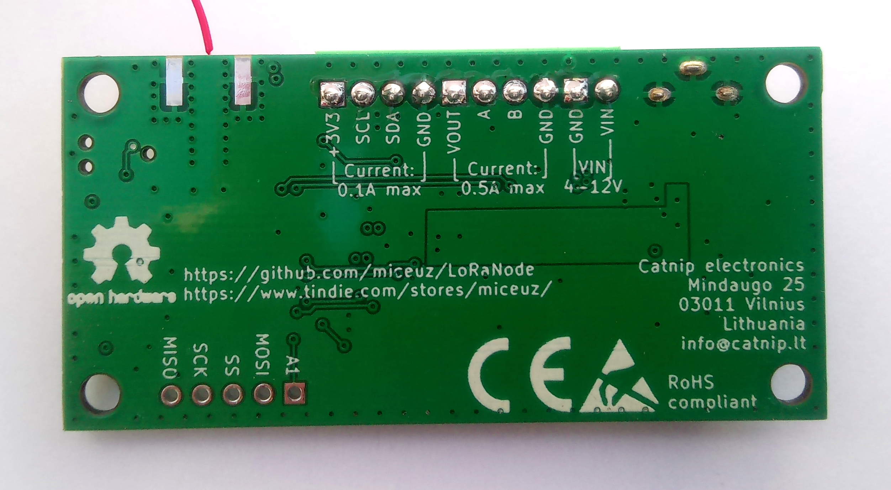

# Radiobus - RS485, I2C, SPI, Serial bridge to LoRaWAN network

This is a low power high reliability board that is specifically designed to easily hook up sensors and actuators to LoRaWAN network.



## Features

* Arduino compatible (Adafruit Feather M0 based)
* Low power:
  * Sleep current - 15uA
  * Message cost @ SF7 - 38mC (~190k messages from 4xAA battery)
  * Power switching for external I2C and RS485 sensors
* ESD protection
* Reverse polarity protection
* Wide input voltage range (up to 12V)
* Footprint for edge SMA antenna connector 

## Hardware resources

 * Connector J1 is fused and over-voltage protected power input, 12V max
 * Connector J4 is RS485 interface. VOUT on this connector is connected to the positive power input. Current of up to 500mA can be supplied from this connector. Q2 and Q1 form a high side switch to switch power to the connected RS485 bus. Digital pin **6 (PIN_RS485_EN)** in Arduino environment can be used to switch power on and off. Digital pin **4 (PIN_RS485_RE)** ir RS485 reader enable, **5 (PIN_RS485_DE)** is RS485 driver enable. **Serial1** on pins 0 and 1 is connected to RS485 transceiver.
 * Connector J3 is I2C interface. +3V3 on this connector is connected to the onboard +3V3 regulator. Up to 100mA can be supplied from this connector. R6 and R7 are I2C pullup resistors with the value of 4.7kOhm. Q7 is a switch that controls power to this connector. Digital pin **7 (PIN_I2C_EN)** in Arduino environment can be used to controll this switch. Control logic is inverted, i.e. writing pin 5 HIGH will disconnect power to J3 and pullups, writing pin 5 LOW, will connect +3V3 to J3 and pullups.
 * Header J6 is SPI interface and an analog input on **A1**.
 * SWD connector is provided for debugging and low level programming. 6-pin [Tag-Connect](https://www.tag-connect.com/product-category/products/cables/6-pin-target) connector can be used
 * Battery level is measured thru resistors R11, R12. Battery voltage is provided to this resistive divider when power to RS485 port is enabled. Voltage proportional to battery voltage is provided on analog pin **A0**. 
 * Led WAN is connected to digital pin **8 (PIN_LED_WAN)**
 * Led SENS is connected to digital pin **9 (PIN_LED_SENS)**
 * Led BATT is connected to digital pin **10 (PIN_LED_BATT)**
 * Button TEST is connected to pin **11 (PIN_TEST_BUTTON)**
 * Button RESET is connected to RESET line of the microcontroller U5.

The board is based on RAK4260 module that utilizes [Microchip SAM R34 SiP](https://www.microchip.com/design-centers/wireless-connectivity/low-power-wide-area-networks/lora-technology/sam-r34-r35). 

## Power

The board is designed to be used with 4xAA 1.5V cells, actually physical dimensions of the board resemble a common cheap 4xAA holder. This strategy was chosen because for low power device it makes little sense to use recheargable batteries as you probably will not want to bring back device from field to charge it, it's much more practical to just change the batteries. 4xAA configuration allows to use up full capacity of AA cell - typically AA cells are totally flat at 0.8V, thus the circuit will stay fully operational till the batteries are flat - 0.8x4=3.2V while microcontroller module works down to 2.8V. 

Nevertheless, power sources up to 12V can be used. Also rechargeable LiPo cells can be used. 

## Antenna

A SMA connector is available on board, a right angle SMA connector designed for 1.6mm thickness board can be fitted. 

Nevertheless, a simple wire works just fine, I was able to transmit messages up to 10km away using a simple piece of wire as an antenna. Solder a piece of single core wire and cut it to a length for your frequency:
 * 868Mhz - 86.3mm
 * 915MHz - 81.9mm

## Firmware

A working example firmware source code is provided. The firmware takes care of setting up radio module, sleep, querying sensors and formatting payload and transmission. 

Example firmware is can be compiled using [PlatformIO](https://platformio.org/) environment. Type ```pio run -t upload``` in the example directory to compile and upload the code. 


### Programming environment setup

A tutorial provided by [Adafruit for Feather M0 boards](https://learn.adafruit.com/adafruit-feather-m0-basic-proto/setup) can be followed for the programming environment setup. In a nutshell:

 * Use Arduino IDE version 1.8 or higher
 * Add this line to **Additional Boards Manager URLs** in preferences dialog: `https://adafruit.github.io/arduino-board-index/package_adafruit_index.json`
 * In the **Boards Manager** add support for **Arduino SAMD Boards** version 1.6.11 or later
 * In the **Boards Manager** add support for **Adafruit SAMD Boards**
 * In **Tools->Board** menu choose **Feather M0**; that's it, you are ready to go

### Libraries used

 * [arduino-lmic](https://github.com/mcci-catena/arduino-lmic) -- you can add it via Arduino Library manager, but cloning the git repo is strongly recommended to get all the latest fixes
 * [RTCZero](https://github.com/arduino-libraries/RTCZero) -- can be installed from Arduino Library manager

## Indication and UI

Three leds are provided on the board called WAN, SENS and BATT. It is up to the user to decide how exaclty to use them, but general guidance is that WAN led displays radio activity, SENS led provides sensor activity or status indication and BATT led provides battery status indication.

RESET and TEST buttons are available. RESET button resets the microcontroller, also it can be used to enter the bootloader mode for firmware upload. If sleep is utilised in the firmware, doubleclick the RESET button to enter the bootloader.

TEST button usage is up to the user.

Serial port is availale via USB-CDC interface, it can be used for debug messages, command line interface or other uses to be decided by the user. Note that in sleep mode USB is disconnected, disable sleep in the firmware to use the serial port.


